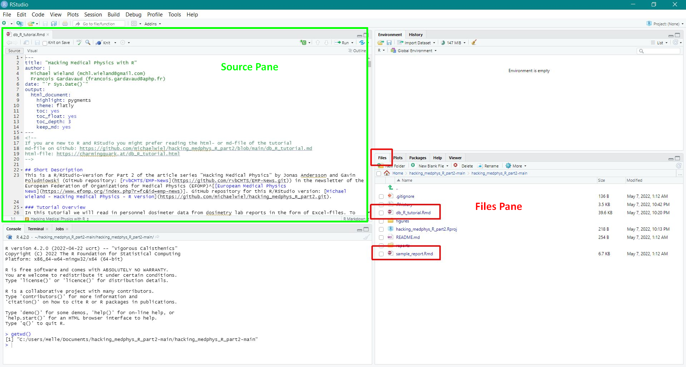
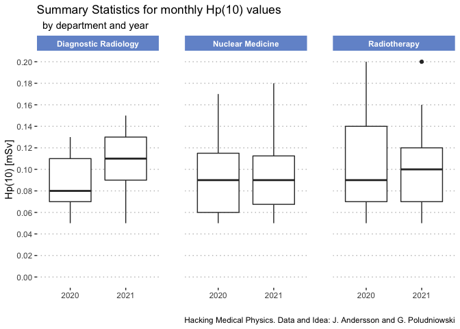
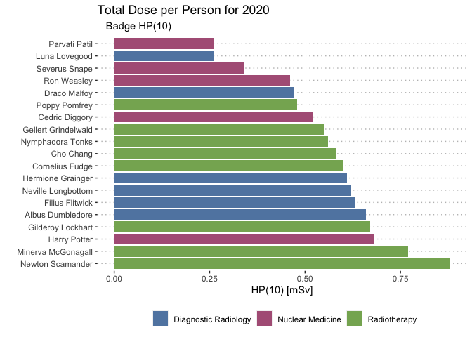
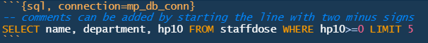

<!-- 
If you are new to R and RStudio you might prefer reading the html- or md-file of the tutorial
md-file on Github: https://github.com/michaelwiel/hacking_medphys_R_part2/blob/main/db_R_tutorial.md
html-file: https://charmingquark.at/db_R_tutorial.html
-->

## Short Description
This is an R/RStudio-Version for Part 2 of the article series "Hacking Medical Physics" by Jonas Andersson and Gavin Poludniowski (GitHub repository: [rvbCMTS/EMP-News](https://github.com/rvbCMTS/EMP-News.git)) in the newsletter of the European Federation of Organizations for Medical Physics (EFOMP)^[[European Medical Physics News](https://www.efomp.org/index.php?r=fc&id=emp-news)]. GitHub repository for this R/RStudio tutorial: [Michael Wieland - Hacking Medical Physics - R Version](https://github.com/michaelwiel/hacking_medphys_R_part2.git).

### Tutorial Overview
In this tutorial we will read in personnel dosimeter data from dosimetry lab reports in the form of Excel-files. To store the data we create a SQLite database which we will then query for data analysis and produce some figures and tables. Additionally we will have a look at the reporting capabilities of R Markdown, discuss parameterized reports and automation of reporting tasks.

### Ressources
In order to run this R Markdown file you need to install [R](https://www.r-project.org/) and [RStudio](https://www.rstudio.com/) ([RStudio Installer](https://www.rstudio.com/products/rstudio/download/)). An alternative IDE to RStudio is the open source IDE [Bio7](https://bio7.org/). Bio7 can be extended with plug-ins, among others with an [ImageJ](https://imagej.nih.gov/ij/)-plug-in for image analysis.   

Resources to get started with R:  

* [RStudio Education - Beginners](https://education.rstudio.com/learn/beginner/)  
* [RStudio Support - Getting Started with R](https://support.rstudio.com/hc/en-us/articles/201141096-Getting-Started-with-R)  
* [RStudio Book Collection](https://www.rstudio.com/products/rstudio/download/)  
* [ggplot2 - Elegent Graphics for Data Analysis](https://ggplot2-book-solutions-3ed.netlify.app/index.html)  

Resources on R Markdown, the tool this tutorial is written with:  

* [R Markdown Cookbook](https://bookdown.org/yihui/rmarkdown-cookbook/)  
* [R Markdown: The Definitive Guide](https://bookdown.org/yihui/rmarkdown/)  

### Working in RStudio
If you haven't done so already, download all files from the GitHub-Repository [michaelwiel/hacking_medphys_R_part2](https://github.com/michaelwiel/hacking_medphys_R_part2). 
Open the file `hacking_medphys_R_part2.Rproj` within RStudio. Opening the project should automatically load two [R Markdown files](https://rmarkdown.rstudio.com/) named `db_R_tutorial.Rmd` and `sample_report.Rmd`. If you can't see them as tabs in the RStudio environment `Source` pane you can open them from the menue with `File -> Open File` or from the `Files`-pane:



<br>
If you are still reading the html-version or md-version of this tutorial we highly recommend to switch to RStudio and keep on reading in the R Markdown file `db_R_tutorial.Rmd` in order to run the code in the tutorial yourself.

### Executing Code
You can run the code in the RStudio `Console` pane or directly in the R Markdown file by clicking on the little "Play"-button in the top right hand corner of the code chunks:


<br>
If you want to test the code yourself you have to execute all of the code in the tutorial from top to bottom (i.e. press the green play button in each code chunk in the order they appear in the text). If you want to start testing the code at some other point in the tutorial you still have to execute all the code before the given point. To execute all the code until the code chunk you want to start with, click the button left from the play button (down facing arrow with a green line below it). 


### Package Setup
<!-- We will make heavy use of the package collection `tidyverse` and the "pipe"-operator (` %>% `). Together with R Markdown they are facilitators of literate programming^[[Wikipedia: Literate programming](https://en.wikipedia.org/wiki/Literate_programming)]. To learn more have a look at: [`tidyverse` - R packages for data science](https://www.tidyverse.org/).   -->

The functionality of R can be vastly extended by installing additional packages. You can download packages from different sources. A safe way to install packages is to do so from within RStudio by clicking on `Tools -> Install packages...` in the menu bar. For R newcomers we added the next code chunks which automate the installation process (don't forget to press the little green play buttons...). 


```r
###################### set-up environment section ################################

# The following lines check if the necessary packages are already installed. 
# If a package is missing it will be installed.
if(!require(tidyverse)){
  install.packages("tidyverse")
}
if(!require(readxl)){
  install.packages("readxl")
}
if(!require(ggthemes)){
  install.packages("ggthemes")
}
if(!require(tibble)){
  install.packages("tibble")
}
if(!require(kableExtra)){
  install.packages("kableExtra")
}
if(!require(RSQLite)){
  install.packages("RSQLite")
}
if(!require(DBI)){
  install.packages("DBI")
}
if(!require(rprojroot)){
  install.packages("rprojroot")
}
```


```r
# loading the necessary packages

# load tidyverse for data handling and visualization
  # tidyverse is actually a collection of packages (ggplot2 for visualization and many more)
library(tidyverse)
# load readxl for reading data from excel files
library(readxl)
# load ggthemes for additional themes for the package ggplot2
library(ggthemes)
# load tibble to deal with tibble format
library(tibble)
# load kableExtra to improve table rendering
library(kableExtra)
# load DBI for communication between R and relational database management systems
library(DBI)
# load RSQLite which embeds the SQLite database engine in R and provides an DBI-compliant interface
library(RSQLite)
```


## Reading in Data
If your data files reside in the working directory you can access them in a relative fashion. Your current working directory should be the folder where this R Markdown-file is stored and the data files are stored in a subfolder called `reports`. If you downloaded the whole repository from Github and open RStudio by clicking the `hacking_medphys_R_part2.RProj`-file you should have the right setup and are good to go.


```r
# If you followed the above steps your working directory should be set correctly.
# Working with Rproj: 
  # https://support.rstudio.com/hc/en-us/articles/200526207-Using-RStudio-Projects
# Anyhow we will make sure that the working directory is set to 
  # the location of the Rproj-File with the next lines

# Find the root directory of the R Project File
root.dir = rprojroot::find_rstudio_root_file()
# Set the project path to the root level
setwd(root.dir)
```


### Reading Data from an Excel File
A quick way to read data from Excel files is to use the `readxl`-package:


```r
read_xls(path = "reports/StaffDoses_1.xls") %>%
  head(5)
```

```
## # A tibble: 5 x 18
##   `Customer name`  `Customer UID` Department `Department UID` Name  `Person UID`
##   <chr>            <chr>          <chr>      <chr>            <chr> <chr>       
## 1 Hogsmeade Royal~ 141            Nuclear M~ 1                Seve~ 12368       
## 2 Hogsmeade Royal~ 141            Nuclear M~ 1                Harr~ 12369       
## 3 Hogsmeade Royal~ 141            Nuclear M~ 1                Parv~ 12370       
## 4 Hogsmeade Royal~ 141            Nuclear M~ 1                Parv~ 12370       
## 5 Hogsmeade Royal~ 141            Nuclear M~ 1                Cedr~ 12371       
## # ... with 12 more variables: Radiation type <chr>, Hp(10) <chr>,
## #   Hp(0.07) <chr>, User type <chr>, Dosimeter type <chr>,
## #   Dosimeter placement <chr>, Dosimeter UID <chr>,
## #   Measurement period (start) <chr>, Measurement period (end) <chr>,
## #   Read date <chr>, Report date <chr>, Report UID <chr>
```

```r
# if you get an error message here check
  # if the working directory is set correctly and 
  # if the subfolder "reports" is in the right position (see above)
```

_Note for R Newcomers:_ If you know the order of the arguments of a function you don't have to supply the argument names. If you open the help for the function `read_xls` by typing `?read_xls` in the console the description of the function includes the list of arguments:  
<br>
`read_xls(path, sheet = NULL, range = NULL, col_names = TRUE, col_types = NULL, ...)`  
<br>
Since `path` is the first argument we could also read in the data by just writing `read_xls("reports/StaffDoses_1.xls")`. It is of course faster to type but on the other side makes the code harder to read if you don't know the function. The second thing to note is that there are a lot of other mandatory arguments but they all have a default value. For example `col_names` is set to `TRUE` by default and this will cause the function to regard the first line in the Excel file as column names and not as data.  


### Fixing the Column Names
Reading the Excel file with the function `read_xls` gives a decent first result. A few things should be changed though in order to work with the data properly. There are a lot of coding style guides out there^[[Coding style, coding etiquette](https://blog.r-hub.io/2022/03/21/code-style/)] but we are going to adhere to the following convention of naming the variables (column titles)^[[Social Science Computing Cooperative - Naming Variables](https://sscc.wisc.edu/sscc/pubs/DWE/book/4-2-naming-variables.html)]:  

> * Use only lower case.  
> * Use the underscore, "_" as a replacment for spaces to separate words (called __snake coding__).
> * ...

Assuming that the reports are always delivered in the same format and structure we can fix the column headers once and use them later on to replace the column names for all reports.


```r
report_column_names <- read_xls(path = "reports/StaffDoses_1.xls",
                                n_max = 0) %>% 
  # to extract the column names we don't need any data therefore we read in n_max=0 lines
    # from the first report
  colnames() %>% # extracting the column names as a vector
  tolower() %>% # convert upper case to lower case
  gsub(pattern = " ", 
       replacement = "_") %>% # replacing blanks with underscores
  gsub(pattern = "[().]", 
       replacement = "")  # deleting round brackets and dots; 
    # the square-brackets function as operator 
      # (all characters inside the square-brackets are identified)

#checking the result:
report_column_names
```

```
##  [1] "customer_name"            "customer_uid"            
##  [3] "department"               "department_uid"          
##  [5] "name"                     "person_uid"              
##  [7] "radiation_type"           "hp10"                    
##  [9] "hp007"                    "user_type"               
## [11] "dosimeter_type"           "dosimeter_placement"     
## [13] "dosimeter_uid"            "measurement_period_start"
## [15] "measurement_period_end"   "read_date"               
## [17] "report_date"              "report_uid"
```

### Read in all Reports from a Folder
To read in all files from a folder we can make use of the function `read.files()` that gives a list of all files in a folder.


```r
list.files(path = "reports") # get a list of all files from a folder
```

```
##  [1] "StaffDoses_1.xls"  "StaffDoses_10.xls" "StaffDoses_11.xls"
##  [4] "StaffDoses_12.xls" "StaffDoses_13.xls" "StaffDoses_14.xls"
##  [7] "StaffDoses_15.xls" "StaffDoses_16.xls" "StaffDoses_17.xls"
## [10] "StaffDoses_18.xls" "StaffDoses_19.xls" "StaffDoses_2.xls" 
## [13] "StaffDoses_20.xls" "StaffDoses_21.xls" "StaffDoses_22.xls"
## [16] "StaffDoses_23.xls" "StaffDoses_24.xls" "StaffDoses_25.xls"
## [19] "StaffDoses_26.xls" "StaffDoses_27.xls" "StaffDoses_28.xls"
## [22] "StaffDoses_3.xls"  "StaffDoses_4.xls"  "StaffDoses_5.xls" 
## [25] "StaffDoses_6.xls"  "StaffDoses_7.xls"  "StaffDoses_8.xls" 
## [28] "StaffDoses_9.xls"
```

We will store the file names in the variable `all_reports_to_read_in`:

```r
all_reports_to_read_in <- list.files("reports") # read the list of file names into a character vector

# number of reports in the folder:
length(all_reports_to_read_in)
```

```
## [1] 28
```

With a loop we read in all data from the folder `reports` into a [data.frame](https://www.rdocumentation.org/packages/base/versions/3.6.2/topics/data.frame)-object:

```r
# create an empty dataframe
  # data.frame: collections of variables which share many of the properties of matrices 
  # and of lists, used as the fundamental data structure by most of R's modeling software.
all_reports <- data.frame() 

# a for-loop to read in all reports
for (i in 1:length(all_reports_to_read_in)) { 
  
  # reading in the i-th report into variable "rep":
  rep <- read_xls(path = paste0("reports/", all_reports_to_read_in[i])) 
  
  # binding together the reports row-wise
  all_reports <- rbind(all_reports, rep) 
}  

# replacing the column names with the fixed names (see above)
colnames(all_reports) <- report_column_names 

# check result
tibble(all_reports) %>% 
  head(3)
```

```
## # A tibble: 3 x 18
##   customer_name      customer_uid department   department_uid name    person_uid
##   <chr>              <chr>        <chr>        <chr>          <chr>   <chr>     
## 1 Hogsmeade Royal I~ 141          Nuclear Med~ 1              Severu~ 12368     
## 2 Hogsmeade Royal I~ 141          Nuclear Med~ 1              Harry ~ 12369     
## 3 Hogsmeade Royal I~ 141          Nuclear Med~ 1              Parvat~ 12370     
## # ... with 12 more variables: radiation_type <chr>, hp10 <chr>, hp007 <chr>,
## #   user_type <chr>, dosimeter_type <chr>, dosimeter_placement <chr>,
## #   dosimeter_uid <chr>, measurement_period_start <chr>,
## #   measurement_period_end <chr>, read_date <chr>, report_date <chr>,
## #   report_uid <chr>
```

### Fixing Data Types
Some data wrangling is needed to get the right data types: 

* All numerical variables should be defined as `double` or `integer`,  
* Replace semicolons with dots in decimal numbers so R can recognize them as numbers ("English convention" for decimal numbers),  
* Create a column `status` before converting `hp10` and `hp007` to numeric in order not to lose information. Where `hp10` and `hp007` have the values "B", "NR" or `NA` (B: Below Measurement Threshold; NR: Not returned; `NA`: Missing Value) we transfer those values to the new column, if the values are numeric we set the value in the new column to "OK".  
* Convert dates to date format  

The dates in the reports have abbreviated month names in English. If your machine `locale` is not set to English you might run into troubles when you convert the dates from the format `character` to format `date`. One way to read in the data correctly with little coding is to set the `locale` on the machine to English temporarily. For date-time conversion to and from `character` see [`strptime`](https://www.rdocumentation.org/packages/base/versions/3.6.2/topics/strptime).


```r
# "warning = FALSE" set in this code chunk to avoid warning messages 
  # raised by creation of NAs by coercion to numeric of the hp10 and hp007 columns

# storing the machine locale setting for time and dates in variable "loc"
loc <- Sys.getlocale("LC_TIME") #

# setting the machine locale for time and dates to "English"
Sys.setlocale("LC_TIME", locale = "English") 
```

```
## [1] "English_United States.1252"
```

```r
# the value for "locale" is depending on the operating system. For Windows the value is "English".
# check the help page with "?Sys.setlocale()" if you are not using Windows.


all_reports_fixed <- all_reports %>% 
  # At first we replace the colon with dots as comma sign 
    # (needed to convert to numeric later on)
  # with the function mutate we create new columns based on existing ones 
    # or modify the content of existing columns
  mutate(hp10 = str_replace_all(hp10, 
                                pattern = ",", 
                                replacement = ".")) %>% 
  mutate(hp007 = str_replace_all(hp007, 
                                 pattern = ",", 
                                 replacement = ".")) %>% 
  # before we convert hp10 and hp007 to numeric we create a new column 
    # with non-numeric values of hp007 in order not to lose information
    # "B": Below Measurement Threshold, 
    # "NR": Not returned, 
    # "NA": missing value; 
    # "OK" where a numeric value exists for the variables hp007)
  mutate(status = case_when(hp007 == "B" ~ "B",
                            hp007 == "NR" ~ "NR",
                            is.na(hp007) ~ NA_character_,
                            is.numeric(as.numeric(hp007)) ~ "OK")) %>% 
  # next we convert columns with numbers to "numeric"
    # (non-numeric values in hp10 and hp007 will be converted to NA automatically)
  mutate(across(c(customer_uid, department_uid, person_uid, hp10, hp007, dosimeter_uid, report_uid), 
                as.numeric)) %>% 
  # next we convert the columns representing dates from "character" to "date"
    # with "format = '%d-%b-%Y'" we tell R that the date is in the form "01-Dec-2021"
  mutate(across(c(measurement_period_start:report_date), 
                as.Date, 
                format = "%d-%b-%Y")) %>% 
  # to make sure we have no duplicated data (same report read in more than once) 
  # we eliminate duplicates with the function "distinct"... after grouping by person_uid and dosimeter_uid
  group_by(person_uid, dosimeter_uid) %>% 
  distinct(report_uid, .keep_all = TRUE) %>%
  ungroup()

# view the data
head(all_reports_fixed)
```

```
## # A tibble: 6 x 19
##   customer_name     customer_uid department   department_uid name     person_uid
##   <chr>                    <dbl> <chr>                 <dbl> <chr>         <dbl>
## 1 Hogsmeade Royal ~          141 Nuclear Med~              1 Severus~      12368
## 2 Hogsmeade Royal ~          141 Nuclear Med~              1 Harry P~      12369
## 3 Hogsmeade Royal ~          141 Nuclear Med~              1 Parvati~      12370
## 4 Hogsmeade Royal ~          141 Nuclear Med~              1 Parvati~      12370
## 5 Hogsmeade Royal ~          141 Nuclear Med~              1 Cedric ~      12371
## 6 Hogsmeade Royal ~          141 Nuclear Med~              1 Cedric ~      12371
## # ... with 13 more variables: radiation_type <chr>, hp10 <dbl>, hp007 <dbl>,
## #   user_type <chr>, dosimeter_type <chr>, dosimeter_placement <chr>,
## #   dosimeter_uid <dbl>, measurement_period_start <date>,
## #   measurement_period_end <date>, read_date <date>, report_date <date>,
## #   report_uid <dbl>, status <chr>
```

```r
# setting back the locale 
Sys.setlocale("LC_TIME", locale = loc) 
```

```
## [1] "German_Austria.1252"
```


## Using R with SQLite

### Ressources and Motivation
For this part we are drawing heavily on the following resources:  

* [RStudio - Databases using R](https://db.rstudio.com/)  
* [Simona Picardi - Reproducible Data Science - Chapter 07 - Interfacing Databases in R with RSQLite](https://ecorepsci.github.io/reproducible-science/rsqlite.html)  
* [SQLite](https://www.sqlite.org/about.html)  
* [SQLite Tutorial](https://www.sqlitetutorial.net/)  
* [RSQLite](https://rsqlite.r-dbi.org/)  

For a limited number of files, like in the example above, working with a database is not necessary but databases have several advantages^[[opentextbc.ca - Database Design](https://opentextbc.ca/dbdesign01/chapter/chapter-3-characteristics-and-benefits-of-a-database)]:  

>* Data Independence (your colleagues might want to access the data with Python or Matlab)  
>* Insulation between data and program  
>* Support for multiple views of data (subsets of the data for different users)  
>* Centralized control over data  
>* Data can be shared  
>* Redundancy can be reduced (ideally each data item is stored in only one place)  
>* Integrity constraints (rules that dictate what can be entered or edited)  
>* Security constraints  

If you are new to SQL and you want to have a possibility to "look into" a SQLite database check out the lightweight and open source GUI [SQLiteStudio](https://sqlitestudio.pl/).
<br>
To connect R to the database management system (DBMS) SQLite we need the [`DBI`-package](https://dbi.r-dbi.org/) and [`RSQLite`-package](https://rsqlite.r-dbi.org/). If you not have done it already go ahead and install the `RSQLite`-package. This will automatically install the `DBI`-package. For detailed information on the `DBI` functions we will use, see the [DBI - Reference](https://dbi.r-dbi.org/reference/).

### Creating or opening a Connection to a Database
With the function `dbConnect` you create a database file or open a connection to an already existing database.  
See [RSQLite Packages Vignette](https://rsqlite.r-dbi.org/reference/sqlite) for a list of optional arguments. The argument `flags` specifies the connection mode:  

* SQLITE_RWC: open the database in read/write mode and create the database file if it does not already exist [DEFAULT];  
* SQLITE_RW: open the database in read/write mode. Raise an error if the file does not already exist;  
* SQLITE_RO: open the database in read only mode. Raise an error if the file does not already exist.  

Since a database can hold many different kinds of data, not only personnel dosimeter readings, we will call the database `medical_physics_db.sqlite`.

```r
mp_db_conn <- dbConnect(drv = RSQLite::SQLite(), 
                        dbname = "medical_physics_db.sqlite")
# opening the connection to the database "medical_physics_db.sqlite" and 
# creating a connection object called "mp_db_conn" that represents the database.
```


### Creating a Table for the Dosimeter Data
In a database all data is stored in tables. For simplicity we will create a single table for the staff dosimeter readings and don't go into details of optimal table design like [functional dependencies](https://en.wikipedia.org/wiki/Functional_dependency) and [normalization](https://en.wikipedia.org/wiki/Database_normalization). 
<br>


#### Our First Table
Before we create our final personnel dosimeter table we are going to have a look at some useful functions and run a few tests. As data we will use a subset (first 10 rows) of the cleaned data we already prepared before (section "Fix data types"). 


```r
# In SQL there are several possibilities to handle date, 
  # one of them is "text" ("character" in R); 
# details see here: https://www.sqlite.org/lang_datefunc.html 
# Therefore we first change the data type of the date columns to "character"
all_reports_fixed_dateastext <- all_reports_fixed %>% 
  mutate(across(c(measurement_period_start:report_date), as.character))

# storing the first 10 rows in a separate data.frame/tibble
arf_rows01to10 <- all_reports_fixed_dateastext[1:10,]
```

The easiest way to create a table is to use the function `dbWriteTable` which takes a dataframe as argument and writes the data into a table.  


```r
# creating a table from a dataframe
dbWriteTable(conn = mp_db_conn,
             name = "test01",
             value  = arf_rows01to10,
             overwrite = TRUE)
# We set the argument "overwrite" to TRUE in case you run this script more than once.
  # If you write data to a table with dbWriteTable() there are three possibilities:
  # 1) The table exists but you want to overwrite it: use the "overwrite = TRUE"
  # 2) The table exists and you want to add data: use "append = TRUE"
  # 3) The table does not exist: neither overwrite or append have to be used
# If the table exists but you neither set append or overwrite to TRUE you will get an error message 

#check if it worked by listing all tables of the database:
dbListTables(conn = mp_db_conn)
```

```
## [1] "test01"
```

Now we execute our first SQL queries with `dbGetQuery()` which returns the result of the query as dataframe.


```r
dbGetQuery(conn = mp_db_conn,
           statement = "SELECT * FROM test01") %>% 
  tibble::tibble()
```

```
## # A tibble: 10 x 19
##    customer_name    customer_uid department    department_uid name    person_uid
##    <chr>                   <dbl> <chr>                  <dbl> <chr>        <dbl>
##  1 Hogsmeade Royal~          141 Nuclear Medi~              1 Severu~      12368
##  2 Hogsmeade Royal~          141 Nuclear Medi~              1 Harry ~      12369
##  3 Hogsmeade Royal~          141 Nuclear Medi~              1 Parvat~      12370
##  4 Hogsmeade Royal~          141 Nuclear Medi~              1 Parvat~      12370
##  5 Hogsmeade Royal~          141 Nuclear Medi~              1 Cedric~      12371
##  6 Hogsmeade Royal~          141 Nuclear Medi~              1 Cedric~      12371
##  7 Hogsmeade Royal~          141 Nuclear Medi~              1 Ron We~      12372
##  8 Hogsmeade Royal~          141 Nuclear Medi~              1 Tom Ma~      12373
##  9 Hogsmeade Royal~          141 Diagnostic R~              2 Hermio~      12374
## 10 Hogsmeade Royal~          141 Diagnostic R~              2 Albus ~      12375
## # ... with 13 more variables: radiation_type <chr>, hp10 <dbl>, hp007 <dbl>,
## #   user_type <chr>, dosimeter_type <chr>, dosimeter_placement <chr>,
## #   dosimeter_uid <dbl>, measurement_period_start <chr>,
## #   measurement_period_end <chr>, read_date <chr>, report_date <chr>,
## #   report_uid <dbl>, status <chr>
```

```r
# Conversion of the resulting dataframe into a tibble (a special form of dataframe) 
  # is only necessary for visualization reasons (more compact output in the rendered html)

# Let's select a subset of columns
dbGetQuery(conn = mp_db_conn,
           statement = "SELECT name, person_uid, dosimeter_uid, report_uid,
                        STRFTIME('%Y-%m', report_date) as report_month 
                        FROM test01")
```

```
##                  name person_uid dosimeter_uid report_uid report_month
## 1       Severus Snape      12368         90072       1137      2019-12
## 2        Harry Potter      12369         90073       1137      2019-12
## 3       Parvati Patil      12370         90075       1137      2019-12
## 4       Parvati Patil      12370         90076       1137      2019-12
## 5      Cedric Diggory      12371         90077       1137      2019-12
## 6      Cedric Diggory      12371         90078       1137      2019-12
## 7         Ron Weasley      12372         90079       1137      2019-12
## 8  Tom Marvolo Riddle      12373         90080       1137      2019-12
## 9   Hermione Grainger      12374         90081       1137      2019-12
## 10   Albus Dumbledore      12375         90082       1137      2019-12
```

```r
# See the structure of the table by using built in pragma statements
  # (https://www.sqlite.org/pragma.html) in a query
dbGetQuery(conn = mp_db_conn,
           statement = "pragma table_info('test01')")
```

```
##    cid                     name type notnull dflt_value pk
## 1    0            customer_name TEXT       0         NA  0
## 2    1             customer_uid REAL       0         NA  0
## 3    2               department TEXT       0         NA  0
## 4    3           department_uid REAL       0         NA  0
## 5    4                     name TEXT       0         NA  0
## 6    5               person_uid REAL       0         NA  0
## 7    6           radiation_type TEXT       0         NA  0
## 8    7                     hp10 REAL       0         NA  0
## 9    8                    hp007 REAL       0         NA  0
## 10   9                user_type TEXT       0         NA  0
## 11  10           dosimeter_type TEXT       0         NA  0
## 12  11      dosimeter_placement TEXT       0         NA  0
## 13  12            dosimeter_uid REAL       0         NA  0
## 14  13 measurement_period_start TEXT       0         NA  0
## 15  14   measurement_period_end TEXT       0         NA  0
## 16  15                read_date TEXT       0         NA  0
## 17  16              report_date TEXT       0         NA  0
## 18  17               report_uid REAL       0         NA  0
## 19  18                   status TEXT       0         NA  0
```

As you can see from the output we don't have a [primary key](https://www.sqlshack.com/learn-sql-primary-key/) (all "pk" are set to 0) and neither have we set a [UNIQUE constraint](https://www.sqlservertutorial.net/sql-server-basics/sql-server-unique-constraint/).  
<br>
Let's see what happens when we add some more data. This time we create a dataframe with rows 10 to 12 from `all_reports_fixed_dateastext`. Row 10 is already in the database and rows 11 and 12 are new data.


```r
arf_rows10to12 <- all_reports_fixed_dateastext[10:12,]

dbWriteTable(conn = mp_db_conn,
             name = "test01",
             value = arf_rows10to12,
             append = TRUE) 
# if there is already a table with the given name we have to 
  # set one of the arguments "append" or "overwrite" to true, 
  # otherwise we will get an error message

dbGetQuery(conn = mp_db_conn,
           statement = "SELECT name, person_uid, dosimeter_uid, 
                        STRFTIME('%Y-%m', report_date) AS report_month
                        FROM test01") %>% 
  tibble()
```

```
## # A tibble: 13 x 4
##    name               person_uid dosimeter_uid report_month
##    <chr>                   <dbl>         <dbl> <chr>       
##  1 Severus Snape           12368         90072 2019-12     
##  2 Harry Potter            12369         90073 2019-12     
##  3 Parvati Patil           12370         90075 2019-12     
##  4 Parvati Patil           12370         90076 2019-12     
##  5 Cedric Diggory          12371         90077 2019-12     
##  6 Cedric Diggory          12371         90078 2019-12     
##  7 Ron Weasley             12372         90079 2019-12     
##  8 Tom Marvolo Riddle      12373         90080 2019-12     
##  9 Hermione Grainger       12374         90081 2019-12     
## 10 Albus Dumbledore        12375         90082 2019-12     
## 11 Albus Dumbledore        12375         90082 2019-12     
## 12 Filius Flitwick         12376         90083 2019-12     
## 13 Neville Longbottom      12377         90084 2019-12
```

Now we have 13 rows in the table which means that we created a duplicate by adding row 10 a second time (entry for the dosimeter reading of Albus Dumbledore from December 2019).  


#### Table with Constraints
In order to avoid duplicates we need constraints like a `PRIMARY KEY` and/or a `UNIQUE` constraint.
There are different strategies to implement constraints but for consistency reasons we will build our dosimeter readings table analogous to the Python tutorial "by hand" and call it `staffdose`.  
As `PRIMARY KEY` we add an `id`-column and set a `UNIQUE`-constraint with `report_uid, person_uid, dosimeter_placement`.  
<br>
First we delete the table `test01` with the function `dbExecute`. This function executes data manipulation statements without returning a result set. The output of `dBExecute` is the number of tables or table rows affected by the statement.


```r
# Cleaning up DB: deleting the test01-table
dbExecute(conn = mp_db_conn, 
          statement = "DROP TABLE IF EXISTS test01")
```

```
## [1] 0
```

```r
# If you run this script a second time 
  # you will get an error message if you try to create a table that already exists.
# Therefore we will run the command "DROP TABLE IF EXISTS" 
  # to delete the table "staffdose" should it already exist:
dbExecute(conn = mp_db_conn, 
          statement = "DROP TABLE IF EXISTS staffdose")
```

```
## [1] 0
```

```r
# check content of the database
dbListTables(conn = mp_db_conn)
```

```
## character(0)
```

```r
# creating the table staffdose
dbExecute(conn = mp_db_conn,
          statement = 
            "CREATE TABLE staffdose (
                id INTEGER NOT NULL PRIMARY KEY,
                customer_name VARCHAR,
                customer_uid INTEGER,
                department VARCHAR,
                department_uid INTEGER,
                name VARCHAR,
                person_uid INTEGER,
                radiation_type VARCHAR,
                hp10 DOUBLE,
                hp007 DOUBLE,
                user_type VARCHAR,
                dosimeter_type VARCHAR,
                dosimeter_placement VARCHAR,
                dosimeter_uid INTEGER,
                measurement_period_start TEXT,
                measurement_period_end TEXT,
                read_date TEXT,
                report_date TEXT,
                report_uid DOUBLE,
                status VARCHAR,
                UNIQUE(report_uid, person_uid, dosimeter_placement)
            );")
```

```
## [1] 0
```

```r
# check if it worked
dbListTables(conn = mp_db_conn)
```

```
## [1] "staffdose"
```

```r
dbListFields(conn = mp_db_conn,
             name = "staffdose")
```

```
##  [1] "id"                       "customer_name"           
##  [3] "customer_uid"             "department"              
##  [5] "department_uid"           "name"                    
##  [7] "person_uid"               "radiation_type"          
##  [9] "hp10"                     "hp007"                   
## [11] "user_type"                "dosimeter_type"          
## [13] "dosimeter_placement"      "dosimeter_uid"           
## [15] "measurement_period_start" "measurement_period_end"  
## [17] "read_date"                "report_date"             
## [19] "report_uid"               "status"
```

```r
# check if "id" is the primary key of the table:
dbGetQuery(conn = mp_db_conn, 
           statement = "pragma table_info('staffdose')") %>% 
  head(1)
```

```
##   cid name    type notnull dflt_value pk
## 1   0   id INTEGER       1         NA  1
```

```r
# the id-column should have the value 1 for "notnull" and "pk" (primary key)
```

Let's try again, add data and then try to add some more data including duplicates:


```r
# adding first set of data
dbAppendTable(conn = mp_db_conn,
             name = "staffdose",
             value = arf_rows01to10)
```

```
## [1] 10
```

```r
# check if data was added
dbGetQuery(conn = mp_db_conn,
           statement = "SELECT name, person_uid, dosimeter_placement, dosimeter_uid, report_uid FROM staffdose")
```

```
##                  name person_uid dosimeter_placement dosimeter_uid report_uid
## 1       Severus Snape      12368                Body         90072       1137
## 2        Harry Potter      12369                Body         90073       1137
## 3       Parvati Patil      12370                Body         90075       1137
## 4       Parvati Patil      12370           Left hand         90076       1137
## 5      Cedric Diggory      12371                Body         90077       1137
## 6      Cedric Diggory      12371          Right hand         90078       1137
## 7         Ron Weasley      12372                Body         90079       1137
## 8  Tom Marvolo Riddle      12373                Body         90080       1137
## 9   Hermione Grainger      12374                Body         90081       1137
## 10   Albus Dumbledore      12375                Body         90082       1137
```

```r
# add dataset with rows already contained in the table
dbWriteTable(conn = mp_db_conn,
             name = "staffdose",
             value = arf_rows10to12,
             append = TRUE)
```

```
## Error: UNIQUE constraint failed: staffdose.report_uid, staffdose.person_uid, staffdose.dosimeter_placement
```

Now you should get an error message like: 
`UNIQUE constraint failed: staffdose.report_uid, staffdose.person_uid, staffdose.dosimeter_placement`.  
<br>
We have achieved our goal to prevent duplicates but unfortunately there is no easy way to just add unique data with any of the functions of the packages `DBI` or `RSQLite`. To solve this problem we need a workaround. 

#### Adding only unique Data
For details and source of the following approach see the forum thread "[RStudio Community - Creating and populating a SQLite database via R - How to ignore duplicate rows?](https://community.rstudio.com/t/creating-and-populating-a-sqlite-database-via-r-how-to-ignore-duplicate-rows/85470/3)".

For the work around we will use a second table called `stage` with the same structure as `staffdose` but without any constraints. The table `stage` will therefore accept any data even if it already exists in `staffdose`. First we will read in the new data into the intermediary table `stage` and can then transfer only the new data to the table `staffdose` with the SQL command `INSERT OR IGNORE INTO staffdose`:


```r
# we use "DROP TABLE IF EXISTS" in case we run the script more than once
dbExecute(conn = mp_db_conn, 
          statement = "DROP TABLE IF EXISTS stage")
```

```
## [1] 0
```

```r
# creating the stage table
dbExecute(conn = mp_db_conn,
          statement = 
            "CREATE TABLE stage (
                id INTEGER,
                customer_name VARCHAR,
                customer_uid INTEGER,
                department VARCHAR,
                department_uid INTEGER,
                name VARCHAR,
                person_uid INTEGER,
                radiation_type VARCHAR,
                hp10 DOUBLE,
                hp007 DOUBLE,
                user_type VARCHAR,
                dosimeter_type VARCHAR,
                dosimeter_placement VARCHAR,
                dosimeter_uid INTEGER,
                measurement_period_start TEXT,
                measurement_period_end TEXT,
                read_date TEXT,
                report_date TEXT,
                report_uid DOUBLE,
                status VARCHAR
            );")
```

```
## [1] 0
```

To make life a little bit easier in the future we will define a function `dbAppendUniqueStaffDose` that will read in new data into the `stage` table and then transfers only the unique data to the `staffdose` table:


```r
dbAppendUniqueStaffDose <- function(connection, newreportdata) {
  # function to add only unique data to the staffdose table
    # by using the stage table as intermediary
  
  # wiping clean stage table
  dbExecute(connection, "DELETE FROM stage")
  
  # add the new data to the stage table
  dbAppendTable(connection, "stage", newreportdata)
  
  # transfer only unique data from the stage table to the staffdose table
  dbExecute(connection, "INSERT OR IGNORE INTO staffdose SELECT * FROM stage")
}
```

Now we can add data successfully without getting an error message, even if the reports contain duplicates that violate the `UNIQUE`-constraint we defined:


```r
dbAppendUniqueStaffDose(connection = mp_db_conn,
                        newreportdata = arf_rows10to12)
```

```
## [1] 2
```

```r
# The output should be "##[1] 2" -> Two rows added (out of the 3 rows 2 were new data)

# Let's view the table:
check <- dbGetQuery(conn = mp_db_conn, 
                    statement = "SELECT name, person_uid, dosimeter_placement, dosimeter_uid, report_uid FROM staffdose"); check
```

```
##                  name person_uid dosimeter_placement dosimeter_uid report_uid
## 1       Severus Snape      12368                Body         90072       1137
## 2        Harry Potter      12369                Body         90073       1137
## 3       Parvati Patil      12370                Body         90075       1137
## 4       Parvati Patil      12370           Left hand         90076       1137
## 5      Cedric Diggory      12371                Body         90077       1137
## 6      Cedric Diggory      12371          Right hand         90078       1137
## 7         Ron Weasley      12372                Body         90079       1137
## 8  Tom Marvolo Riddle      12373                Body         90080       1137
## 9   Hermione Grainger      12374                Body         90081       1137
## 10   Albus Dumbledore      12375                Body         90082       1137
## 11    Filius Flitwick      12376                Body         90083       1137
## 12 Neville Longbottom      12377                Body         90084       1137
```

```r
# looks good

# Check if the data of the first 12 rows is really without duplicates
  # by comparing the table content with the data from the dataframe 
all(check == all_reports_fixed[1:12,
                               c("name", "person_uid", "dosimeter_placement", "dosimeter_uid", "report_uid")])
```

```
## [1] TRUE
```

```r
# if we have only TRUEs we only added unique data

# Let's add all the data to the staffdose table with the function we created
dbAppendUniqueStaffDose(connection = mp_db_conn, 
                        newreportdata = all_reports_fixed_dateastext)
```

```
## [1] 600
```

```r
# The output states the number of rows added to the table (should be 600 in our case)
```

### Data Analysis with SQL and R
Next we are going to analyze our data in the database and produce some nice graphs and tables.  

#### Hp(10) - Summary Statistics by Department and Year


```r
# Preparing the parameterized query
# params:
stat <- "OK"
dos_type <- "Badge"
year <- c("2020", "2021")

# query the data
sumstat <- dbGetQuery(conn = mp_db_conn,
                      statement = 
                        "SELECT hp10, department, STRFTIME('%Y', measurement_period_end) AS report_year 
                        FROM staffdose WHERE hp10>=0 
                        AND status = ? AND dosimeter_type = ?
                        AND report_year BETWEEN ? AND ?",
                        params = c(stat, dos_type, year)) 
```

For plotting we will use the popular `tidyverse`-package [`ggplot2`](https://ggplot2.tidyverse.org/):

```r
sumstat %>% 
  ggplot(aes(x=report_year, y=hp10)) + # chosing x and y-axis variables
  geom_boxplot() + # chosing form of the plot
  # modifying y-axis:
  scale_y_continuous(limits = c(0, NA), 
                      # set lower bound to 0 and let ggplot automatically set upper bound
                     breaks = pretty(c(0, max(all_reports_fixed$hp10, na.rm = T)), 
                                     n=10)) + 
                      # getting 10 breaks in the y-axis from 0 to maximum value of hp10
  # adding labels:
  labs(x = "", y = "Hp(10) [mSv]",
       title = "Summary Statistics for monthly Hp(10) values",
       subtitle = "  by department and year",
       caption = "Hacking Medical Physics. Data and Idea: J. Andersson and G. Poludniowski") +
  # tweaking the plot style (optional) with the function "theme":
  theme(panel.background = element_blank(),
        panel.grid.major.y = element_line(linetype = 3, color = "gray"),
        panel.spacing.x = unit(1, "cm"),
        strip.text = element_text(face = "bold", color = "white"),
        strip.background = element_rect(fill = "#7395D1")) +
  # split up the data into subplots for the different departments:
  facet_wrap(~ department) 
```

<!-- -->

It takes some time to learn ggplot (the grammar of graphics). If you need some help you might find the package [`esquisse`](https://cran.r-project.org/web/packages/esquisse/vignettes/get-started.html) useful. It provides a graphical interface to create plots with ggplot interactively.

#### Number of Staff Dose Readings per Dosimeter Type

```r
# params:
stat = "NR"

# query data
nr_staffd_readings <- dbGetQuery(conn = mp_db_conn,
                                 statement = 
             "SELECT COUNT(hp10) AS hp10, COUNT(hp007) AS hp007, dosimeter_type  
              FROM staffdose 
              WHERE status != ?
              GROUP BY dosimeter_type",
              params = stat) %>% 
  relocate(dosimeter_type)
```

The packages `kable` and `kableExtra` help us to create [nice tables](https://cran.r-project.org/web/packages/kableExtra/vignettes/awesome_table_in_html.html):

```r
nr_staffd_readings %>% 
  kable(align = "lcc", # kable is a function to produce tables
        col.names = c("Dosimeter Type", "Hp(10)", "Hp(0.07)"), 
        caption = "Number of dosimeter readings per dosimeter type") %>% 
  kable_styling(bootstrap_options = c("striped", "hover")) # a function to further tweak tables
```

<table class="table table-striped table-hover" style="margin-left: auto; margin-right: auto;">
<caption>Number of dosimeter readings per dosimeter type</caption>
 <thead>
  <tr>
   <th style="text-align:left;"> Dosimeter Type </th>
   <th style="text-align:center;"> Hp(10) </th>
   <th style="text-align:center;"> Hp(0.07) </th>
  </tr>
 </thead>
<tbody>
  <tr>
   <td style="text-align:left;"> Badge </td>
   <td style="text-align:center;"> 403 </td>
   <td style="text-align:center;"> 403 </td>
  </tr>
  <tr>
   <td style="text-align:left;"> Ring </td>
   <td style="text-align:center;"> 0 </td>
   <td style="text-align:center;"> 47 </td>
  </tr>
</tbody>
</table>

#### Individuals who did not return their Dosimeters

```r
# params:
stat = "NR"

# query and print table
dbGetQuery(conn = mp_db_conn,
           statement = 
             "SELECT name, COUNT(status) as instances
              FROM staffdose
              WHERE status = ?
              GROUP BY name
              ORDER BY instances DESC",
              params = stat) %>% 
  kable(align = "lc", 
        col.names = c("Name", "Instances"), 
        caption = "Number of times a dosimeter was not returned per person") %>% 
  kable_styling(bootstrap_options = c("striped", "hover")) 
```

<table class="table table-striped table-hover" style="margin-left: auto; margin-right: auto;">
<caption>Number of times a dosimeter was not returned per person</caption>
 <thead>
  <tr>
   <th style="text-align:left;"> Name </th>
   <th style="text-align:center;"> Instances </th>
  </tr>
 </thead>
<tbody>
  <tr>
   <td style="text-align:left;"> Tom Marvolo Riddle </td>
   <td style="text-align:center;"> 28 </td>
  </tr>
  <tr>
   <td style="text-align:left;"> Luna Lovegood </td>
   <td style="text-align:center;"> 14 </td>
  </tr>
</tbody>
</table>

#### Total Badge HP(10) Staff Dose Readings per Department

```r
#params
stat = "OK"
year = 2020
dos_type = "Badge"

#query and graph
dbGetQuery(conn = mp_db_conn,
           statement = 
             "SELECT name, department, SUM(hp10) AS hp10_total, STRFTIME('%Y', measurement_period_end) AS report_year
              FROM staffdose
              WHERE hp10>0 AND report_year = ? AND status = ? AND dosimeter_type = ?
              GROUP BY name",
              params = c(year, stat, dos_type)) %>% 
  ggplot(aes(x=reorder(name, desc(hp10_total)), y=hp10_total, fill = department)) +
  geom_col() +
  scale_fill_manual(values = c("#6186B0", "#B06186", "#86B061")) +
  labs(x = "", y = "HP(10) [mSv]", fill = "",
       title = "Total Dose per Person for 2020",
       subtitle = "   Badge HP(10)") +
  coord_flip() +
  theme(legend.position = "bottom",
        panel.background = element_blank(),
        panel.grid.major.y = element_line(linetype = 3, color = "gray"))
```

<!-- -->

### SQL Engine in R Markdown
As we will discuss in the next section, R Markdown is an incredible powerful tool. One of its cool features is its ability to ["speak" SQL](https://bookdown.org/yihui/rmarkdown/language-engines.html#sql) and other languages. You can not only use R code chunks but others too. When using a SQL code chunk you don't need the `DBI`-functions, you can write native SQL queries.  
Here is an example of a SQL code chunk (note that it starts with `sql` instead of `r` and you have to provide a connection to a database):  




```sql
-- comments can be added by starting the line with two minus signs
SELECT name, department, hp10 FROM staffdose WHERE hp10>=0 LIMIT 5
```


<div class="knitsql-table">
<table>
<caption>5 records</caption>
 <thead>
  <tr>
   <th style="text-align:left;"> name </th>
   <th style="text-align:left;"> department </th>
   <th style="text-align:right;"> hp10 </th>
  </tr>
 </thead>
<tbody>
  <tr>
   <td style="text-align:left;"> Severus Snape </td>
   <td style="text-align:left;"> Nuclear Medicine </td>
   <td style="text-align:right;"> 0.09 </td>
  </tr>
  <tr>
   <td style="text-align:left;"> Cedric Diggory </td>
   <td style="text-align:left;"> Nuclear Medicine </td>
   <td style="text-align:right;"> 0.11 </td>
  </tr>
  <tr>
   <td style="text-align:left;"> Albus Dumbledore </td>
   <td style="text-align:left;"> Diagnostic Radiology </td>
   <td style="text-align:right;"> 0.08 </td>
  </tr>
  <tr>
   <td style="text-align:left;"> Filius Flitwick </td>
   <td style="text-align:left;"> Diagnostic Radiology </td>
   <td style="text-align:right;"> 0.11 </td>
  </tr>
  <tr>
   <td style="text-align:left;"> Neville Longbottom </td>
   <td style="text-align:left;"> Diagnostic Radiology </td>
   <td style="text-align:right;"> 0.13 </td>
  </tr>
</tbody>
</table>

</div>

### Closing the Connection to the Database
When we are finished we close the connection to the database:

```r
dbDisconnect(mp_db_conn)
```


## Reporting with R Markdown
R is one of the most important statistics software solutions out there and together with RStudio and its integration of [R Markdown](https://RMarkdown.rstudio.com/) it is an incredible versatile tool for data analysis and reporting. The tutorial you are reading is compiled from a R Markdown file.  
<br>
From the [R Markdown website](https://RMarkdown.rstudio.com/):

> R Markdown supports dozens of static and dynamic output formats including HTML, PDF, MS Word, Beamer, HTML5 slides, Tufte-style handouts, books, dashboards, shiny applications, scientific articles, websites, and more ([see gallery](https://RMarkdown.rstudio.com/gallery.html)). 

>Creating documents with R Markdown starts with an .Rmd file that contains a combination of markdown (content with simple text formatting) and R code chunks. The .Rmd file is fed to knitr, which executes all of the R code chunks and creates a new markdown (.md) document which includes the R code and its output.

](figures/markdown_knitting_process.png)

You might have to write reports for your department, your hospital, the authorities, ... where you have to present data. With [knitr](https://yihui.org/knitr/) you can convert your R Markdown file into a Word document and even use word-templates you create or your organization provides for you. With an additional Latex-Installation like [TinyTeX](https://yihui.org/tinytex/) you can create pdf-documents and there are many more options.  


### Sample Report
The easiest way to start is to create a report as html-file that you can then print to pdf with a web browser of your choice. Check out the `sample_report.Rmd`-file for an example. If the file is not loaded in the `Source` pane, open it from the `Files` pane.  
We included a parameterization for departments and years in the so called YAML-header. With that parameterization you can create reports for each department and year from one R Markdown file interactively. More on parameterized reports: [R Markdown: The Definitive Guide - Chapter 15](https://bookdown.org/yihui/rmarkdown/parameterized-reports.html). 
<br>
Open the file `sample_report.Rmd` and read the instructions for more information.

### Multiple Parameterized Reports
You can of course automate this task too. Say you have to create a version of the sample report each year for all departments. If you already have prepared the parameterized report you can automate this with `rmarkdown::render()`. Executing the next code chunk by clicking the "play button" generates reports for all departments for the year 2021 in your working directory (called "Report-Radiotherapy-2021",...).


```r
# chunk option "eval= FALSE" -> not executed when Rmd rendered.

# set a year (character for SQL query)
year <- 2021


# get list of department names for which dosimeter readings for chosen year exist
# opening connection (read only)
mp_db_conn <- dbConnect(drv = RSQLite::SQLite(),
                        dbname = "medical_physics_db.sqlite",
                        flags = SQLITE_RO)
# getting a list of departments for which data is available for the chosen year
dep <- dbGetQuery(mp_db_conn, 
           "SELECT department, hp10, STRFTIME('%Y', report_date) AS report_year 
           FROM staffdose
           WHERE hp10 >=0 AND report_year = ?",
           params = as.character(year)) %>% 
  distinct(department) 
# closing connection
dbDisconnect(conn = mp_db_conn)


# creating reports for all departments for which dosimeter readings for chosen year exist
# creating a function with parameters department and year
render_report = function(department, year) {
  rmarkdown::render(
    "sample_report.Rmd", params = list(
      department = department,
      year = year
    ),
    output_file = paste0("Report-", department, "-", year, ".html")
  )
}

# looping through all departments and using the function "render_report" to create the reports
for (department in dep[,1]) {
  render_report(department, year)
}
```

