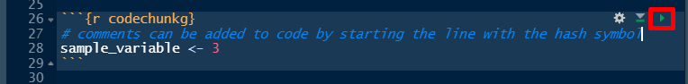

```{r setup, warning=FALSE, message=FALSE}
knitr::opts_chunk$set(echo = TRUE)

library(tidyverse)
library(readxl)
library(ggthemes)
library(kableExtra)
library(tibble)
library(DBI)
#library(RSQLite)
# https://cran.r-project.org/web/packages/RSQLite/vignettes/RSQLite.html
```

## Short Description
This is a R/RStudio-Version for Part 2 of the article series "Hacking Medical Physics" by Jonas Andersson and Gavin Poludniowski (GitRepo: [rvbCMTS/EMP-News](https://github.com/rvbCMTS/EMP-News.git)) in the newsletter of the European Federation of Organisations for Medical Physics (EFOMP)^[[European Medical Physics News](https://www.efomp.org/index.php?r=fc&id=emp-news)].

### Ressources and Preparation
In order to run this R-Markdown file you need to install RStudio/R ([RStudio Installer](https://www.rstudio.com/products/rstudio/download/)).  

Ressources to get started with R:  

* [RStudio Education - Beginners](https://education.rstudio.com/learn/beginner/)  
* [RStudio Support - Getting Started with R](https://support.rstudio.com/hc/en-us/articles/201141096-Getting-Started-with-R)  
* [RStudio Book Collection](https://www.rstudio.com/products/rstudio/download/)  
* [ggplot2 - Elegent Graphics for Data Analysis](https://ggplot2-book-solutions-3ed.netlify.app/index.html)  

I will make heavy use of the package collection `tidyverse` and the "pipe"-operator (` %>% `). To learn more have a look at: [`tidyverse` - R packages for data science](https://www.tidyverse.org/).  
If you have not installed the packages loaded in the `setup code chunk` (see above) start with installing them via `Tools` -> `Install Packages`.

### Executing Code
You can run the code in the console window or directly in the RMarkdwon-file by clicking on the little "Play"-button in the top right hand corner of the code chunks:




## Reading in Data
If your data files reside in the working directory you can access them in a relative fashion. My current working directory is the folder where this R-Markdown-file is stored and the data files are stored in a subfolder called "reports".

### Reading an Excel File
My preferred method to read Excel files is to use the `readxl`-package:

```{r reading_excel}
read_xls(path = "reports/StaffDoses_1.xls") %>% 
  head(5)
```

_Note for R Newcomers:_ If you know the order of the arguments of a function you don't have to supply the argument names. If you open the help for the function `read_xls` by typing `?read_xls` in the console the description of the function includes the list of arguments:  
<br>
`read_xls(path, sheet = NULL, range = NULL, col_names = TRUE, col_types = NULL, ...)`  
<br>
Since `path` is the first argument we could also read in the data by just writing `read_xls("reports/StaffDoses_1.xls")`. It is of course faster to type but on the other side makes the code harder to read if you don't know the function. The second thing to note is that there are a lot of other mandatory arguments but they all have default value. For example `col_names` is set to `TRUE` by default and this will cause the function to regard the first line in the excel file as column names and not as data.  


### Fixing the column names
Reading the Excel-File with the function `read_xls` from the package `readxl` gives a decent first result. A few things should be changed though in order to work with the data properly. The variable names (column titles) should adhere to the following convention^[[Social Science Computing Cooperative - Naming Variables](https://sscc.wisc.edu/sscc/pubs/DWE/book/4-2-naming-variables.html)]:  

> * Use only lower case.  
> * Use the underscore, "_" as a replacment for spaces to separate words (called __snake coding__).
> * ...

Assuming that the reports are always delivered in the same format and structure we can fix the column headers once and use them later on to replace the column names for all reports.

```{r fixing_report_header}
report_column_names <- read_xls(path = "reports/StaffDoses_1.xls",
                                n_max = 0) %>% 
  # to extract the column names we don't need any data therefore we read in n=0 lines
  colnames() %>% # extracting the column names as a vector
  tolower() %>% # convert upper case to lower case
  gsub(pattern = " ", 
       replacement = "_") %>% # replacing blanks with underscores
  gsub(pattern = "[().]", 
       replacement = "")  # deleting round brackets and dots; 
    # the square-brackets function as list operator (all characters inside the square-brackets are identified)

#checking the rsult:
report_column_names
```

### Read in all reports from a folder
To read in all files from a folder we can make use of the function `read.files()` that gives a list of all files in a folder.

```{r read_all_files_from_folder}
list.files(path = "reports") # get a list of all files from a folder
all_reports_to_read_in <- list.files("reports") # read the list of file names in a character vector

# number of reports in the folder:
length(all_reports_to_read_in)

all_reports <- data.frame() # create an empty dataframe

for (i in 1:length(all_reports_to_read_in)) { # a for-loop to read in all reports
  
  # reading in the i-th report into variable "rep":
  rep <- read_xls(path = paste0("reports/", all_reports_to_read_in[i])) 
  
  all_reports <- rbind(all_reports, rep) # binding together the reports rowwise
}  

colnames(all_reports) <- report_column_names # replacing the column names with the fixed names (see above)
```

### Fix data types
Some data wrangling is needed to get the right data types: 

* All numerical variables should be defined as `double` or `integer`,  
* Replace "," with "." in decimal numbers so R can recognise them as numbers ("English convention" for decimal numbers),  
* Create a column `status` before converting `hp10` and `hp007` to numeric in order not to lose information. Where `hp10` and `hp007` have the values "B", "NR" or `NA` (B: Below Measurement Treshold; NR: Not returned; `NA`: Missing Value) we transfer those values to the new column, if the values are numeric we set the value in the new column to "OK".  

To fix the dates I needed a work around because my machine `locale` is set to German but the dates in the reports have abbreviated month names in English. One way to read in the data correctly with little coding is to set the `locale` on the machine to English temporarily. For date-time conversion to and from character see [`strptime`](https://www.rdocumentation.org/packages/base/versions/3.6.2/topics/strptime).


```{r fix_data_types, warning=FALSE}
# getting locale
loc <- Sys.getlocale("LC_TIME") # storing the machine locale setting for time and dates in variable "loc"
Sys.setlocale("LC_TIME", locale = "English") # setting the machine locale for time and dates to "English"
# the value for "locale" is depending on the operating system. For Windows the value is "English".
# check the help page with "?Sys.setlocale()" if you are not using Windows.


all_reports_fixed <- all_reports %>% 
  # At first we replace the colon with dots as comma sign 
    # (needed to convert to numeric later on)
  # with the function mutate we create new columns based on existing ones 
    # or modify the content of existing columns
  mutate(hp10 = str_replace_all(hp10, 
                                pattern = ",", 
                                replacement = ".")) %>% 
  mutate(hp007 = str_replace_all(hp007, 
                                 pattern = ",", 
                                 replacement = ".")) %>% 
  # before we convert hp10 and hp007 to numeric we create a new column 
    # with non-numeric values of hp007 in order not to lose information
    # "B": Below Measurement Threshold, 
    # "NR": Not returned, 
    # "NA": missing value; 
    # "OK" where a numeric value exists for the variables hp007)
  mutate(status = case_when(hp007 == "B" ~ "B",
                            hp007 == "NR" ~ "NR",
                            is.na(hp007) ~ NA_character_,
                            is.numeric(as.numeric(hp007)) ~ "OK")) %>% 
  # next we convert columns with numbers to numeric 
    # (non-numeric values in hp10 and hp007 will be converted to NA automatically)
  mutate(across(c(customer_uid, department_uid, person_uid, hp10, hp007, dosimeter_uid, report_uid), 
                as.numeric)) %>% 
  # next we convert the columns representing dates from "character" to "date"
    # with "format = '%d-%b-%Y'" we tell R that the date is in the form "01-Dec-2021"
  mutate(across(c(measurement_period_start:report_date), 
                as.Date, 
                format = "%d-%b-%Y")) %>% 
  # to make sure we have no duplicated data (same report read in more than once) 
  # we eliminate duplicates with the function "distinct"... after grouping by person_uid and dosimeter_uid
  group_by(person_uid, dosimeter_uid) %>% 
  distinct(report_uid, .keep_all = TRUE) %>%
  ungroup()

head(all_reports_fixed)

Sys.setlocale("LC_TIME", locale = loc) # setting back the locale 
```

#--------  
__Comment Michael: Discussion necessary regarding status column__  
```{r testing, echo=FALSE, eval=FALSE}

# DELETE CODE CHUNK IN FINAL VERSION  

# DISCUSSION REGARDING STATUS COLUMN -> SEEMS IT IS ONLY NECESSARY TO READ STATUS FROM HP007

colnames(all_reports)
all_reports %>% 
  select(hp10, hp007, user_type, dosimeter_type, dosimeter_placement)


# First versinon where 
all_reports_fixed <- all_reports %>% 
  # In first step we are replacing the colon with dots as comma sign (needed to convert to numeric later on)
  # with the function mutate we create new columns based on existing ones or modify the content of existing columns
  mutate(hp10 = str_replace_all(hp10, pattern = ",", replacement = ".")) %>% 
  mutate(hp007 = str_replace_all(hp007, pattern = ",", replacement = ".")) %>% 
  # before we convert hp10 and hp007 to numeric we create new columns with non-numeric values of hp10 and hp007 in order not to lose information
  # "B": Below Measurement Treshold, "NR": Not returned, "NA": missing value; "OK" where a numeric value exisists for the variables hp10 and hp007)
  mutate(hp10_status = case_when(hp10 == "B" ~ "B", 
                                 hp10 == "NR" ~ "NR",
                                 is.na(hp10) ~ NA_character_, 
                                 is.numeric(as.numeric(hp10)) ~ "OK"),
         hp007_status = case_when(hp007 == "B" ~ "B", 
                                 hp007 == "NR" ~ "NR",
                                 is.na(hp007) ~ NA_character_, 
                                 is.numeric(as.numeric(hp007)) ~ "OK")) %>% 
  # next we convert relevant columns to numeric (non-numeric values in hp10 and hp007 will be converted to NA automatically)
  mutate(across(c(customer_uid, department_uid, person_uid, hp10, hp007, dosimeter_uid, report_uid), as.numeric)) %>% 
  # to make sure we have no duplicated data (same report read in more than once, identified by "report_uid") 
  # we eliminate duplicates with the function "distinct"... after grouping by person_uid and dosimeter_uid
  mutate(across(c(measurement_period_start:report_date), as.Date, format = "%d-%b-%Y")) %>% 
  group_by(person_uid, dosimeter_uid) %>% 
  distinct(report_uid, .keep_all = TRUE) %>%
  ungroup()

```

#--------


## Data Analysis

### Hp(10) - Summary Statistics by Department and Year
```{r hp10_summary_stat}
all_reports_fixed %>% 
  drop_na(hp10) %>%  # droping all rows where no dose was recorded (altough ggplot can handle NAs)
  mutate(report_year = format(report_date, "%Y")) %>% # extracting the year from the report date
  filter(report_year %in% c("2020", "2021")) %>% # chose years 2020 and 2021
  ggplot(aes(x=report_year, y=hp10)) +
  geom_boxplot() +
  scale_y_continuous(limits = c(0,NA), 
                      # set lower bound to 0 and let ggplot automatically set upper bound
                     breaks = pretty(c(0, max(all_reports_fixed$hp10, na.rm = T)), n=10)) + 
                      # getting 10 breaks in the y-axis from 0 to maximum value of hp10
  labs(x = "", y = "Hp(10) [mSv]", # Axis names
       title = "Summary Statistics for monthly Hp(10) values",
       subtitle = "  by department and year",
       caption = "Hacking Medical Physics. Data and Idea: J. Andersson and G. Poludniowski") +
  # tweaking the plot style (optional) with the function "theme":
  theme(panel.background = element_blank(),
        panel.grid.major.y = element_line(linetype = 3, color = "gray"),
        panel.spacing.x = unit(1, "cm"),
        strip.text = element_text(face = "bold", color = "white"),
        strip.background = element_rect(fill = "#D47B60")) +
  facet_wrap(~ department) # split up the data into subplots for the different departments
```

### Number of Staff Dose Readings per Dosimeter Type
```{r nr_dose_readings}
all_reports_fixed %>% 
  filter(user_type == "Staff") %>% # Filter for Staff readings
  filter(! status %in% c("NR", "B")) %>% # filter out "NR" and "B"
  # grouping by dosimeter type to count both types separately
  group_by(dosimeter_type) %>% # to count dosimeter readings depending on type
  summarise(sum(!is.na(hp10)), length(!is.na(hp007))) %>% 
   # counting the rows with numeric values only (that are not NA)
    # OBS: !is.na(a) gives back TRUE if a variable is NOT NA. 
          # In R the logical value TRUE is equivalent to 1. 
    # Therefore summing over a vector of logical values gives the number of "TRUE"s.
  kable(align = "lcc", # kable is a function to produce tables
        col.names = c("Dosimeter Type", "Hp(10)", "Hp(0.07)"), 
        caption = "Number of dosimeter readings per dosimeter type") %>% 
  kable_styling(bootstrap_options = c("striped", "hover")) # a function to further tweak tables
```


### Individuals who did not return their Dosimeters
```{r not returned}
all_reports_fixed %>% 
  filter(status == "NR") %>% 
  count(name) %>% 
  kable(align = "lc", # kable is a function to produce tables
        col.names = c("Name", "Instances"), 
        caption = "Number of times a dosimeter was not returned per person") %>% 
  kable_styling(bootstrap_options = c("striped", "hover")) # a function to further tweak tables
```


## Using R with SQL

### Ressources and Motivation
For this part I am drawing heavily on the following ressources:  

* [RStudio - Databases using R](https://db.rstudio.com/)  
* [Simona Picardi - Reproducible Data Science - Chapter 07 - Interfacing Databases in R with RSQLite](https://ecorepsci.github.io/reproducible-science/rsqlite.html)  
* [SQLite Tutorial](https://www.sqlitetutorial.net/)  


For a limited number of files like in the example above working with a database is not necessary but databases have several advantages^[[opentextbc.ca - Database Design](https://opentextbc.ca/dbdesign01/chapter/chapter-3-characteristics-and-benefits-of-a-database)]:  

>* Data Independence (your colleagues might want to access the data with Python or Matlab)  
>* Insulation between data and program  
>* Support for multiple views of data (subsets of the data for different users)  
>* Centralized control over data  
>* Data can be shared  
>* Redundancy can be reduced (ideally each data item is stored in only one place)  
>* Integrity constraints (rules that dictate what can be entered or edited)  
>* Security constraints  

If you are new to SQL and you want to have a possibilty to "look into" a SQLite database check out the leightweight and open source GUI [SQLiteStudio](https://sqlitestudio.pl/).
<br>
To connect R to a database management system (DBMS) we need the [`DBI`-package](https://dbi.r-dbi.org/) and [`RSQLite`](https://rsqlite.r-dbi.org/). If you not have done it already go ahead and install the `RSQLite`-package which will automatically install the `DBI`-package. For detailed information on the `DBI` functions we will use see the [DBI - Reference](https://dbi.r-dbi.org/reference/).

### Creating (or opening a connection to) a Database
With the funciton `dbConnect` you create a database file or open a connection to an already existing database.  
See [RSQLite Packages Vignette](https://rsqlite.r-dbi.org/reference/sqlite) for a list of optional arguments. The argument "flags" specifies the connection mode:  

* SQLITE_RWC: open the database in read/write mode and create the database file if it does not already exist [DEFAULT];  
* SQLITE_RW: open the database in read/write mode. Raise an error if the file does not already exist;  
* SQLITE_RO: open the database in read only mode. Raise an error if the file does not already exist.  

Since a database can hold many different kinds of data, not only personnel dosimeter readings, I will call the database `medical_physics_db.sqlite`.
```{r creating_a_db}
mp_db_conn <- dbConnect(drv = RSQLite::SQLite(), 
                        dbname = "medical_physics_db.sqlite")
# opening the connection and 
# creating a connection object called "staff_dose_db_conn" that represents the database.
```


### Creating a Table for the Dosimeter Data
In a database all data is stored in tables. For simplicity we will create a single table for the staff dosimeter readings and don't go into details of optimal table design like [functional dependencies](https://opentextbc.ca/dbdesign01/chapter/chapter-11-functional-dependencies/) and [normalization](https://en.wikipedia.org/wiki/Database_normalization). 
<br>

#### Our First Table
Before we create our final personnel dosimeter table we are going to have a look at some useful functions and run a view tests. As data we will use a subset (first 10 rows) of the cleaned data we already prepared before (section "Fix data types"). 

```{r table_test_dataprep}
# In SQL there are several possibilities to handle date, I prefer "text"; 
# details see here: https://www.sqlite.org/lang_datefunc.html 
# Therefore we first change the data type of the date columns to text
all_reports_fixed_dateastext <- all_reports_fixed %>% 
  mutate(across(c(measurement_period_start:report_date), as.character))

# storing the first 10 rows in a seperate dataframe
arf_rows01to10 <- all_reports_fixed_dateastext[1:10,]
```

The easiest way to create a table is by using the function `dbWriteTable` which takes a dataframe as argument and writes the data into a table.  

```{r table_test02}
# creating a table from a dataframe
dbWriteTable(conn = mp_db_conn,
             name = "test01",
             value  = arf_rows01to10,
             overwrite = TRUE)
# I set the argument "overwrite" to TRUE in case you run this script more than once.
  # If you write data to a table with dbWriteTable() there are three possibilites:
  # 1) The table exists but you want to overwrite it: use the "overwrite = TRUE"
  # 2) The table exists and you want to add data: use "append = TRUE"
  # 3) The table does not exist: neither overwrite or append have to be used
# If the table exists but you neither set append or overwrite to TRUE you will get an error message 

#check if it worked by listing all tables of a database:
dbListTables(conn = mp_db_conn)
```

Now we execute our first SQL queries with `dbGetQuery()` which returns the result of the query as dataframe.

```{r table_test03}
dbGetQuery(conn = mp_db_conn,
           statement = "SELECT * FROM test01") %>% # "SELECT *": to select all columns 
  tibble::tibble()

# Lets select a subset of columns
dbGetQuery(conn = mp_db_conn,
           statement = "SELECT name, person_uid, dosimeter_uid, report_uid, report_date FROM test01")

# See the structure of the table by using built in pragma statements
  # (https://www.sqlite.org/pragma.html) in a query
dbGetQuery(conn = mp_db_conn,
           statement = "pragma table_info('test01')")
```

As you can see from the output we don't have a primary key (all "pk" are set to 0) and neither have we set a UNIQUE constraint.  
<br>
Lets see what happens if we add some more data. This time we create a dataframe with rows 10 to 12 from `all_reports_fixed_dateastext`. Row 10 is already in the database and rows 11 and 12 are new data.

```{r table_test04}
arf_rows10to12 <- all_reports_fixed_dateastext[10:12,]

dbWriteTable(conn = mp_db_conn,
             name = "test01",
             value = arf_rows10to12,
             append = TRUE) 
# if there is already a table with the given name we have to 
# set one of the arguments "append" or "overwrite" to true, 
# otherwise we will get an error message

dbGetQuery(conn = mp_db_conn,
           statement = "SELECT name, person_uid, dosimeter_uid, report_uid report_date FROM test01") %>% 
  tibble()
```

Now we have 13 rows in the table which means that we created a duplicate by adding row 10 a second time (entry for the dosimeter reading of Albus Dumbledore from December 2019).  


#### Table with Constraints
In order to avoid duplicates we need constraints like a `PRIMARY KEY` and/or a `UNIQUE` constraint.
There are different strategies to implement constraints but for consistency reasons we will build our dosimeter readings table analogous to the Python tutorial "by hand" and call it `staffdose`.  
As `PRIMARY KEY` we add an `id`-column and set a `UNIQUE`-constraint with `report_uid, person_uid, dosimeter_placement`.  
<br>
First we delete the table `test01` with the function `dbExecute`. This function executes data manipulation statements without returning a result set.
```{r creating_a_table, error=TRUE}
# First we clean up the database by deleting the test01-table
dbExecute(conn = mp_db_conn, 
          statement = "DROP TABLE IF EXISTS test01")

# If you run this script a second time 
# you will get an error message if you try to create a table that already exists.
# Therefore we will run the command "DROP TABLE IF EXISTS" to delete the table "staffdose" if it already exists:
dbExecute(conn = mp_db_conn, 
          statement = "DROP TABLE IF EXISTS staffdose")

# check content of the database
dbListTables(mp_db_conn)

# creating the table
dbExecute(conn = mp_db_conn,
          statement = 
            "CREATE TABLE staffdose (
                id INTEGER NOT NULL PRIMARY KEY,
                customer_name VARCHAR,
                customer_uid INTEGER,
                department VARCHAR,
                department_uid INTEGER,
                name VARCHAR,
                person_uid INTEGER,
                radiation_type VARCHAR,
                hp10 DOUBLE,
                hp007 DOUBLE,
                user_type VARCHAR,
                dosimeter_type VARCHAR,
                dosimeter_placement VARCHAR,
                dosimeter_uid INTEGER,
                measurement_period_start TEXT,
                measurement_period_end TEXT,
                read_date TEXT,
                report_date TEXT,
                report_uid DOUBLE,
                status VARCHAR,
                UNIQUE(report_uid, person_uid, dosimeter_placement)
            );")

# check if it worked
dbListTables(mp_db_conn)
# you can see that there are two tables:
  # "staffdose" (the one we defined) and 
  # "sqlite_sequence" automatically created because we used "AUTOINCREMENT"
    # for info on "sqlite_sequence" see: https://www.sqlite.org/autoinc.html

# check if "id" is the primary key of the table:
dbGetQuery(mp_db_conn, 
           "pragma table_info('staffdose')") %>% 
  head(1)
# the id-column should have the values 1 for "notnull" and "pk" (primary key)
```

Lets try again, add data and then try to add some more data including duplicates:

```{r table_add_data_duplicates, error=TRUE}
# adding data
dbAppendTable(conn = mp_db_conn,
             name = "staffdose",
             value = arf_rows01to10)

# check if data was added
dbGetQuery(conn = mp_db_conn,
           statement = "SELECT name, person_uid, dosimeter_placement, dosimeter_uid, report_uid FROM staffdose")

# add dataset with duplicates
dbWriteTable(conn = mp_db_conn,
             name = "staffdose",
             value = arf_rows10to12,
             append = TRUE)
```

Now you should get an error message like: 
`UNIQUE constraint failed: staffdose.report_uid, staffdose.person_uid, staffdose.dosimeter_placement`.  
<br>
We have achieved our goal to prevent duplicates but unfortunately there is no easy way to just add unique data with any of the functions of the packages `DBI` or `RSQLite`. To solve this problem we need a workaround. 

#### Adding only unique Data
For details and source of the following approach see the forum thread "[RStudio Community - Creating and populating a SQLite database via R - How to ignore duplicate rows?](https://community.rstudio.com/t/creating-and-populating-a-sqlite-database-via-r-how-to-ignore-duplicate-rows/85470/3)".

For the work around we will use a second table called `stage` with the same structure as `staffdose` but without any constraints. The table `stage` will therefore accept any data even if it already exists in `staffdose`. Next we will read in the new data into the intermediary table `stag` and can then transfer only the new data 
to the table `staffdose` with the command `INSERT OR IGNORE INTO staffdose`:

```{r create_stage}
# we use "DROP TABLE IF EXISTS" in case we run the script more than once
dbExecute(conn = mp_db_conn, 
          statement = "DROP TABLE IF EXISTS stage")

# creating the stage table
dbExecute(conn = mp_db_conn,
          statement = 
            "CREATE TABLE stage (
                id INTEGER,
                customer_name VARCHAR,
                customer_uid INTEGER,
                department VARCHAR,
                department_uid INTEGER,
                name VARCHAR,
                person_uid INTEGER,
                radiation_type VARCHAR,
                hp10 DOUBLE,
                hp007 DOUBLE,
                user_type VARCHAR,
                dosimeter_type VARCHAR,
                dosimeter_placement VARCHAR,
                dosimeter_uid INTEGER,
                measurement_period_start TEXT,
                measurement_period_end TEXT,
                read_date TEXT,
                report_date TEXT,
                report_uid DOUBLE,
                status VARCHAR
            );")
```

To make life a little bit easier in the future we will define a function `dbAppendUniqueStaffDose` that will read in new data into the `stage` table and then transfers only the unique data to the `staffdose` table:

```{r add_only_unique_function}
dbAppendUniqueStaffDose <- function(connection, newreportdata) {
  # function to add only unique data to the staffdose table
    # by using the stage table as intermediary
  
  # wiping clean stage table
  dbExecute(connection, "DELETE FROM stage")
  
  # add the new data to the stage table
  dbAppendTable(connection, "stage", newreportdata)
  
  # transfer only unique data from the stage table to the staffdose table
  dbExecute(connection, "INSERT OR IGNORE INTO staffdose SELECT * FROM stage")
}
```

Now we can add data succesfully without getting an error message, even if it contains duplicates that violate the `UNIQUE`-constraint we defined:

```{r add_new_data_with_some_duplicates}
dbAppendUniqueStaffDose(connection = mp_db_conn,
                        newreportdata = arf_rows10to12)

# lets view the table:
check <- dbGetQuery(mp_db_conn, "SELECT name, person_uid, dosimeter_placement, dosimeter_uid, report_uid FROM staffdose"); check
# looks good

# Check if the data of the first 12 rows is really without duplicates
  # by comparing the table content with the data from the dataframe 
check == all_reports_fixed[1:12, c("name", "person_uid", "dosimeter_placement", "dosimeter_uid", "report_uid")]
# if we have only TRUEs we only added unuique data

# lets add all the data to the staffdose table
dbAppendUniqueStaffDose(mp_db_conn, all_reports_fixed_dateastext)
```

### Data Analysis with SQL and R

#### SQL: Hp(10) - Summary Statistics by Department and Year
```{r sql_datana_sumstat}
# Preparing the parameterized query
# params:
stat <- "OK"
dos_type <- "Badge"
year <- c(2020,2021)

dbGetQuery(conn = mp_db_conn,
           statement = 
             "SELECT hp10, department, STRFTIME('%Y', measurement_period_end) AS report_year 
                FROM staffdose WHERE hp10>=0 
                AND status = ? AND dosimeter_type = ?
                AND report_year BETWEEN ? AND ?",
                params = c(stat, dos_type, year)) %>% 
  ggplot(aes(x=report_year, y=hp10)) +
  geom_boxplot() +
  scale_y_continuous(limits = c(0,NA), 
                      # set lower bound to 0 and let ggplot automatically set upper bound
                     breaks = pretty(c(0, max(all_reports_fixed$hp10, na.rm = T)), n=10)) + 
                      # getting 10 breaks in the y-axis from 0 to maximum value of hp10
  labs(x = "", y = "Hp(10) [mSv]", # Axis names
       title = "Summary Statistics for monthly Hp(10) values",
       subtitle = "  by department and year",
       caption = "Hacking Medical Physics. Data and Idea: J. Andersson and G. Poludniowski") +
  # tweaking the plot style (optional) with the function "theme":
  theme(panel.background = element_blank(),
        panel.grid.major.y = element_line(linetype = 3, color = "gray"),
        panel.spacing.x = unit(1, "cm"),
        strip.text = element_text(face = "bold", color = "white"),
        strip.background = element_rect(fill = "#7395D1")) +
  facet_wrap(~ department) # split up the data into subplots for the different departments
```

#### SQL: Number of Staff Dose Readings per Dosimeter Type
```{r sql_nr_staff_dose_readings}
# params:
stat = "NR"

# query and print table
dbGetQuery(conn = mp_db_conn,
           statement = 
             "SELECT COUNT(hp10) AS hp10, COUNT(hp007) AS hp007, dosimeter_type  
              FROM staffdose 
              WHERE status != ?
              GROUP BY dosimeter_type",
              params = stat) %>% 
  relocate(dosimeter_type) %>% # settingr dosimeter_type as first column
  kable(align = "lcc", # kable is a function to produce tables
        col.names = c("Dosimeter Type", "Hp(10)", "Hp(0.07)"), 
        caption = "Number of dosimeter readings per dosimeter type") %>% 
  kable_styling(bootstrap_options = c("striped", "hover")) # a function to further tweak tables
```

#### SQL: Individuals who did not return their Dosimeters
```{r sql_individ_not_returned_dosim}
# params:
stat = "NR"

# query and print table
dbGetQuery(conn = mp_db_conn,
           statement = 
             "SELECT name, COUNT(status) as instances
              FROM staffdose
              WHERE status = ?
              GROUP BY name
              ORDER BY instances DESC",
              params = stat) %>% 
  kable(align = "lc", # kable is a function to produce tables
        col.names = c("Name", "Instances"), 
        caption = "Number of times a dosimeter was not returned per person") %>% 
  kable_styling(bootstrap_options = c("striped", "hover")) # a function to further tweak tables
```

#### SQL: Total badge HP(10) Staff Dose Readings per Department
```{r sql_total_dose_2020}
#params
stat = "OK"
year = 2020
dos_type = "Badge"

#query and figure

dbGetQuery(conn = mp_db_conn,
           statement = 
             "SELECT name, department, SUM(hp10) AS hp10_total, STRFTIME('%Y', measurement_period_end) AS report_year
              FROM staffdose
              WHERE hp10>0 AND report_year = ? AND status = ? AND dosimeter_type = ?
              GROUP BY name",
              params = c(year, stat, dos_type)) %>% 
  ggplot(aes(x=reorder(name, desc(hp10_total)), y=hp10_total, fill = department)) +
  geom_col() +
  scale_fill_manual(values = c("#6186B0", "#B06186", "#86B061")) +
  labs(x = "", y = "HP(10) [mSv]", fill = "",
       title = "Total Dose per Person for 2020",
       subtitle = "   Badge HP(10)") +
  coord_flip() +
  theme(legend.position = "bottom",
        panel.background = element_blank(),
        panel.grid.major.y = element_line(linetype = 3, color = "gray"))
```

### SQL Engine in RMarkdown
As I will discuss in the next section, RMarkdown is an incredible powerful tool. One of its cool features is its ability to ["speak" SQL](https://bookdown.org/yihui/rmarkdown/language-engines.html#sql) and other languages. You can not only use "r code chunks" but others too. When using a "SQL code chunk" you don't need the `DBI`-functions, you can write native SQL queries:

```{sql, connection=mp_db_conn}
SELECT name, department, hp10 FROM staffdose WHERE hp10>=0 LIMIT 5
```

### Closing the connection to the database
When we are finished we close the connection to the database:
```{r closing_connection_to_db, error=TRUE}
dbDisconnect(mp_db_conn)
```


## Reporting with RMarkdown
R is one of the most important statistics software solutions out there and together with RStudio and its integration of [R Markdown](https://rmarkdown.rstudio.com/) it is an inedible versatile tool for data analysis and reporting. The tutorial you are reading is compiled from a R Markdown file. From the [R Markdown website](https://rmarkdown.rstudio.com/):

> R Markdown supports dozens of static and dynamic output formats including HTML, PDF, MS Word, Beamer, HTML5 slides, Tufte-style handouts, books, dashboards, shiny applications, scientific articles, websites, and more ([see gallery](https://rmarkdown.rstudio.com/gallery.html)). 

You might have to write reports for your department, your hospital, the authorities, ... where you have to present data. With [knitr](https://yihui.org/knitr/) you can convert your R Markdown file into a Word document and even use word-templates you create or your organization provides for you. With an additional Latex-Installation like [TinyTeX](https://yihui.org/tinytex/) you can create pdf-documents and there are many more options.  
<br>

The easiest way to start is to create a report as html-file that you can then print to pdf with your browser. Check out the `sample_report.Rmd`-file for an example. I also included a parameterization for the departments in the YAML-header. With that parameterization you can create reports for each department from one R Markdown file. More on parameterized reports: [R Markdown: The Definitive Guide - Chapter 15](https://bookdown.org/yihui/rmarkdown/parameterized-reports.html). 
