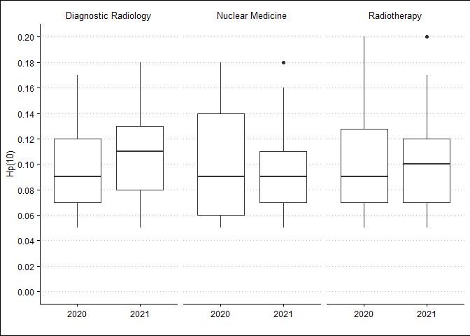

```r
knitr::opts_chunk$set(echo = TRUE)

library(tidyverse)
library(readxl)
library(ggthemes)
```

## Short Description
This is a R Version for Part 2 of the Article Series "Hacking Medical Physics" by Jonas Andersson and Gavin Poludniowski i (GitRepo: [rvbCMTS/EMP-News](https://github.com/rvbCMTS/EMP-News.git)) in the Newsletter of the European Federation of Organisations for Medical Physics (EFOMP)^[[European Medical Physics News](https://www.efomp.org/index.php?r=fc&id=emp-news)].

## Preparation
In order to run this R-Markdown file you need to install RStudio/R ([RStudio Installer](https://www.rstudio.com/products/rstudio/download/)).  

Ressources to get started with R:  

* [RStudio Education - Beginners](https://education.rstudio.com/learn/beginner/)  
* [RStudio Support - Getting Started with R](https://support.rstudio.com/hc/en-us/articles/201141096-Getting-Started-with-R)  
* [RStudio Book Collection](https://www.rstudio.com/products/rstudio/download/)  
* [ggplot2 - Elegent Graphics for Data Analysis](https://ggplot2-book-solutions-3ed.netlify.app/index.html)  

I will make heavy use of the package collection `tidyverse` and the "pipe"-operator (` %>% `). To learn more have a look at: [`tidyverse` - R packages for data science](https://www.tidyverse.org/).  
If you have not installed the packages loaded in the `setup code chunk` (see above) start with installing them via `Tools` -> `Install Packages`.

## Reading in Data
If your data files reside in the working directory you can access them in a relative fashion. My current working directory is the folder where this R-Markdown-File is stored and the data files are stored in a subfolder called "reports".

### Reading an Excel File
My preferred method to read Excel files is to use the `readxl`-package:


```r
read_xls(path = "reports/StaffDoses_1.xls")
```

```
## # A tibble: 22 x 18
##    `Customer name` `Customer UID` Department `Department UID` Name  `Person UID`
##    <chr>           <chr>          <chr>      <chr>            <chr> <chr>       
##  1 Hogsmeade Roya~ 141            Nuclear M~ 1                Seve~ 12368       
##  2 Hogsmeade Roya~ 141            Nuclear M~ 1                Harr~ 12369       
##  3 Hogsmeade Roya~ 141            Nuclear M~ 1                Parv~ 12370       
##  4 Hogsmeade Roya~ 141            Nuclear M~ 1                Parv~ 12370       
##  5 Hogsmeade Roya~ 141            Nuclear M~ 1                Cedr~ 12371       
##  6 Hogsmeade Roya~ 141            Nuclear M~ 1                Cedr~ 12371       
##  7 Hogsmeade Roya~ 141            Nuclear M~ 1                Ron ~ 12372       
##  8 Hogsmeade Roya~ 141            Nuclear M~ 1                Tom ~ 12373       
##  9 Hogsmeade Roya~ 141            Diagnosti~ 2                Herm~ 12374       
## 10 Hogsmeade Roya~ 141            Diagnosti~ 2                Albu~ 12375       
## # ... with 12 more rows, and 12 more variables: Radiation type <chr>,
## #   Hp(10) <chr>, Hp(0.07) <chr>, User type <chr>, Dosimeter type <chr>,
## #   Dosimeter placement <chr>, Dosimeter UID <chr>,
## #   Measurement period (start) <chr>, Measurement period (end) <chr>,
## #   Read date <chr>, Report date <chr>, Report UID <chr>
```

### Fixing the column names
Reading the Excel-File with the function `read_xls` from the package `readxl` gives a decent first result. A few things should be changed though in order to work with the data properly. The variable names (column titles) should follow the following convention^[[Social Science Computing Cooperative - Naming Variables](https://sscc.wisc.edu/sscc/pubs/DWE/book/4-2-naming-variables.html)]:  
>
>* Use only lower case.  
>* Use the underscore, "_" as a replacment for spaces to separate words (called __snake coding__).
>* ...
>

Assuming that the reports are always delivered in the same format and structure we can fix the column headers once and use them later on to replace the column names for all reports.


```r
report_column_names <- read_xls(path = "reports/StaffDoses_1.xls",
         n_max = 0) %>% # to extract the column names we don't need any data 
  colnames() %>% # exctracting the column names as a vector
  tolower() %>% # convert upper case to lower case
  # next we use the function "gsub":
    # https://statisticsglobe.com/sub-gsub-r-function-example
    # https://rstudio-pubs-static.s3.amazonaws.com/74603_76cd14d5983f47408fdf0b323550b846.html
  gsub(pattern = " ", replacement = "_") %>% # replacing blanks with underscores
  gsub(pattern = "[().]", replacement = "")  # replacing round brackets and dots; 
    # the square-brackets function as list operator (all characters inside the square-brackets are identified)

report_column_names
```

```
##  [1] "customer_name"            "customer_uid"            
##  [3] "department"               "department_uid"          
##  [5] "name"                     "person_uid"              
##  [7] "radiation_type"           "hp10"                    
##  [9] "hp007"                    "user_type"               
## [11] "dosimeter_type"           "dosimeter_placement"     
## [13] "dosimeter_uid"            "measurement_period_start"
## [15] "measurement_period_end"   "read_date"               
## [17] "report_date"              "report_uid"
```

### Read in all reports from a folder
To read in all files from a folder we can make use of the function `read.files()` that gives a list of all files in a folder.


```r
list.files("reports") # get a list of all files from a folder
```

```
##  [1] "StaffDoses_1.xls"  "StaffDoses_10.xls" "StaffDoses_11.xls"
##  [4] "StaffDoses_12.xls" "StaffDoses_13.xls" "StaffDoses_14.xls"
##  [7] "StaffDoses_15.xls" "StaffDoses_16.xls" "StaffDoses_17.xls"
## [10] "StaffDoses_18.xls" "StaffDoses_19.xls" "StaffDoses_2.xls" 
## [13] "StaffDoses_20.xls" "StaffDoses_21.xls" "StaffDoses_22.xls"
## [16] "StaffDoses_23.xls" "StaffDoses_24.xls" "StaffDoses_25.xls"
## [19] "StaffDoses_26.xls" "StaffDoses_27.xls" "StaffDoses_28.xls"
## [22] "StaffDoses_3.xls"  "StaffDoses_4.xls"  "StaffDoses_5.xls" 
## [25] "StaffDoses_6.xls"  "StaffDoses_7.xls"  "StaffDoses_8.xls" 
## [28] "StaffDoses_9.xls"
```

```r
all_reports_to_read_in <- list.files("reports")

# number of reports in the folder:
length(all_reports_to_read_in)
```

```
## [1] 28
```

```r
all_reports <- data.frame() # create a dataframe to hold all reports

for (i in 1:length(all_reports_to_read_in)) { # a for-loop to read in all reports
  rep <- read_xls(path = paste0("reports/", all_reports_to_read_in[i])) # reading in the i-th report into veriable "rep"
  all_reports <- rbind(all_reports, rep)
}  

colnames(all_reports) <- report_column_names # replacing the column names with the fixed names (see above)
```

### Fix data types
Some data wrangling is needed to get the right data types: 

* All numerical variables are defined as `double` or `integer`,  
* Replace "," with "." in decimal numbers so R can recognise them as numbers,  
* Create new columns `hp10_status` and `hp007_status` before converting `hp10` and `hp007` to numeric in order not to lose information. Where `hp10` and `hp007` have the values B, NR or `NA` (B: Below Measurement Treshold; NR: Not returned; `NA`: Missing Value) we transfer those values to the new columns, if the values are numeric we set the value in the new columns to OK.  

To fix the dates I needed a work around because my machine `locale` is set to German but the dates in the reports have abbreviated month names in English. One way to read in the data correctly with little coding is to set the `locale` on the machine to English temporarily.


```r
# getting locale
loc <- Sys.getlocale("LC_TIME")
Sys.setlocale("LC_TIME", locale = "English") 
```

```
## [1] "English_United States.1252"
```

```r
# the value for "locale" is depending on the operating system
# check the help page with "?Sys.setlocale()" if you are not using Windows


all_reports_fixed <- all_reports %>% 
  mutate(hp10 = str_replace_all(hp10, pattern = ",", replacement = ".")) %>% # replacing the colon with dots as comma sign (needed to convert to numeric later on)
  mutate(hp007 = str_replace_all(hp007, pattern = ",", replacement = ".")) %>% # replacing the colon with dots as comma sign (needed to convert to numeric later on) 
  # before we convert hp10 and hp007 to numeric we create new columns with non-numeric values of hp10 and hp007 in order not to lose information
  # "B": Below Measurement Treshold, "NR": Not returned)
  mutate(hp10_status = case_when(hp10 == "B" ~ "B", 
                                 hp10 == "NR" ~ "NR",
                                 is.na(hp10) ~ NA_character_, 
                                 is.numeric(as.numeric(hp10)) ~ "OK"),
         hp007_status = case_when(hp007 == "B" ~ "B", 
                                 hp007 == "NR" ~ "NR",
                                 is.na(hp007) ~ NA_character_, 
                                 is.numeric(as.numeric(hp007)) ~ "OK")) %>% 
  # next we convert relevant columns to numeric, non-numeric values in hp10 and hp007 will be converted to NA automatically
  mutate(across(c(customer_uid, department_uid, person_uid, hp10, hp007, dosimeter_uid, report_uid), as.numeric)) %>% 
  # to make sure we have no duplicated data (same report read in more than once, identified by "report_uid") 
  # we eliminate duplicates with the function "distinct"... after grouping by person_uid and dosimeter_uid
  mutate(across(c(measurement_period_start:report_date), as.Date, format = "%d-%b-%Y")) %>% 
  group_by(person_uid, dosimeter_uid) %>% 
  distinct(report_uid, .keep_all = TRUE) %>%
  ungroup()

head(all_reports_fixed)
```

```
## # A tibble: 6 x 20
##   customer_name     customer_uid department   department_uid name     person_uid
##   <chr>                    <dbl> <chr>                 <dbl> <chr>         <dbl>
## 1 Hogsmeade Royal ~          141 Nuclear Med~              1 Severus~      12368
## 2 Hogsmeade Royal ~          141 Nuclear Med~              1 Harry P~      12369
## 3 Hogsmeade Royal ~          141 Nuclear Med~              1 Parvati~      12370
## 4 Hogsmeade Royal ~          141 Nuclear Med~              1 Parvati~      12370
## 5 Hogsmeade Royal ~          141 Nuclear Med~              1 Cedric ~      12371
## 6 Hogsmeade Royal ~          141 Nuclear Med~              1 Cedric ~      12371
## # ... with 14 more variables: radiation_type <chr>, hp10 <dbl>, hp007 <dbl>,
## #   user_type <chr>, dosimeter_type <chr>, dosimeter_placement <chr>,
## #   dosimeter_uid <dbl>, measurement_period_start <date>,
## #   measurement_period_end <date>, read_date <date>, report_date <date>,
## #   report_uid <dbl>, hp10_status <chr>, hp007_status <chr>
```

```r
Sys.setlocale("LC_TIME", locale = loc) # setting back the locale 
```

```
## [1] "German_Austria.1252"
```


## Reporting

### Hp(10) - Summary Statistics by Department and Year

```r
all_reports_fixed %>% 
  drop_na(hp10) %>%  # droping all rows where no dose was recorded (not really necessary, ggplot can handle NAs)
  mutate(report_year = format(report_date, "%Y")) %>% # exctracting the year from the report date
  filter(report_year %in% c("2020", "2021")) %>% # chose years 2020 and 2021
  ggplot(aes(x=report_year, y=hp10)) +
  geom_boxplot() +
  scale_y_continuous(limits = c(0,NA), # set lower bound to 0 and let ggplot automatically set upper bound
                     breaks = pretty(c(0, max(all_reports_fixed$hp10, na.rm = T)), n=10)) + # getting 10 breaks in the y-axis
  labs(x = "", y = "Hp(10)") +
  theme_clean() +
  facet_wrap(~ department) # split up into subplots for the different departments
```

<!-- -->

