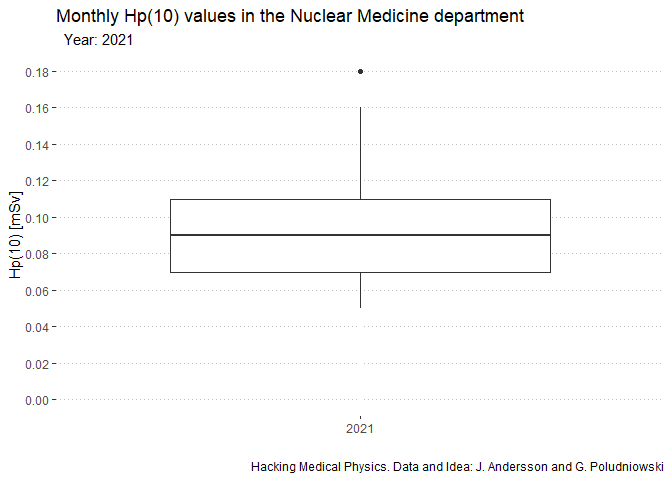

## Report Styling
As little teaser I added a logo to the report via the YAML header. There are a lot of packages that allow you to use templates for all kinds of formats. If you know your way around HMTL & CSS you can create your own templates and even write a package which adds your own template to the selection of templates when you create a new R Markdown file. The possibilities are almost endless. Here are some ressources:  

* [RStudio - R Markdown Gallery](https://rmarkdown.rstudio.com/gallery.html)  
* [The Epidemiologist R Handbook - Chapter 40 - Reports with R Markdown](https://epirhandbook.com/en/reports-with-r-markdown.html)  
* [R Markdown - The Definitive Guide](https://bookdown.org/yihui/rmarkdown/)  
* [R Markdown Cookbook](https://bookdown.org/yihui/rmarkdown-cookbook/)  
* [Blogdown - Creating Websites with R Markdown](https://bookdown.org/yihui/blogdown/)  
* [Bookdown - Authoring Books and Technical Documnents with R Markdown](https://bookdown.org/yihui/bookdown/)  
* [R Markdown for Scientists](https://rmd4sci.njtierney.com/)  
* [Pimp my RMD: a few tips for R Mardkown](https://holtzy.github.io/Pimp-my-rmd/)  

## Parameterized Report
If you have a look in the YAML header you will find a `params`-section. With that configuration you can use `Knit with parameters...`. This opens a dialogue where you can select one of the departments and create the report for that department. Try it yourself, click `Knit with parameters...` and then change the department and the year. For this sample report it is definitely an overkill but imagine you have a 20 page report...  
More on parameterized reports: [R Markdown: The Definitive Guide - Chapter 15](https://bookdown.org/yihui/rmarkdown/parameterized-reports.html).

\newpage

## Graph on page 2
With the LaTeX command `\newpage` in the R Markdown file you can insert page breaks for printing the HTML-file to pdf.

<!-- -->

